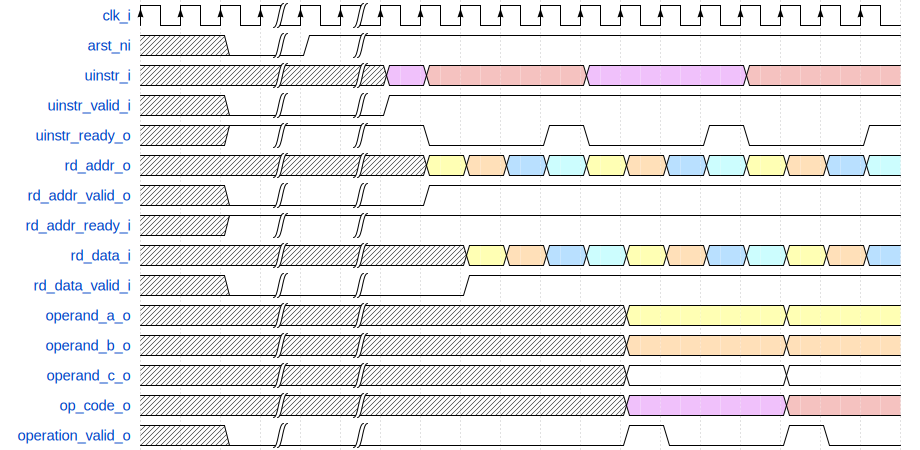
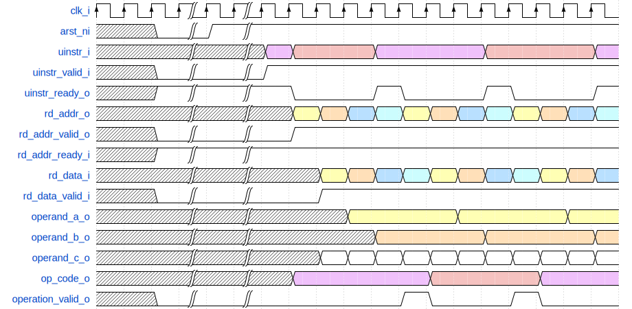

# Operand Controller

## Parameters
| Parameter | Type | Default Value | Description             |
|-----------|------|---------------|-------------------------|
| AW        | int  | 5             | Address bus width       |
| DW        | int  | 2048          | Data bus width          |
| CW        | int  | 8             | Operation Code width    |

## Type definations
| Type     | Definition         | Description        |
|----------|--------------------|--------------------|
| addr_t   | `logic [AW-1:0]`   | Address bus type   |
| data_t   | `logic [DW-1:0]`   | Data bus type      |
| w_data_t | `logic [2*DW-1:0]` | Wide Data bus type |
| code_t   | `logic [CW-1:0]`   | code type          |
| uinstr_t | packed structure  `addr_t vrs1;`   `addr_t vrs2;`   `addr_t vrs3;`   `code_t opcode;` | micro instruction type |

## Signals
| Signal            | Direction | Type     | Description                   |
|-------------------|-----------|----------|-------------------------------|
| clk_i             | input     | logic    | sync clock                    |
| arst_ni           | input     | logic    | asynchronous active low reset |
| uinstr_i          | input     | logic    | mircro instruction            |
| uinstr_valid_i    | input     | logic    | mircro instruction valid      |
| uinstr_ready_o    | output    | logic    | mircro instruction ready      |
| rd_addr_o         | output    | addr_t   | read request address          |
| rd_addr_valid_o   | output    | logic    | read request valid            |
| rd_addr_ready_i   | input     | logic    | read request ready            |
| rd_data_i         | input     | data_t   | read response data            |
| rd_data_valid_i   | input     | logic    | read response valid           |
| operand_a_o       | output    | data_t   | operand a                     |
| operand_b_o       | output    | data_t   | operand b                     |
| operand_c_o       | output    | w_data_t | operand c                     |
| op_code_o         | output    | code_t   | operation code                |
| operation_valid_o | output    | logic    | operation valid               |

## Blackbox Diagram

## Expected Operation Waveform (optimistic)

## Non-pipelined output for understanding purpose

